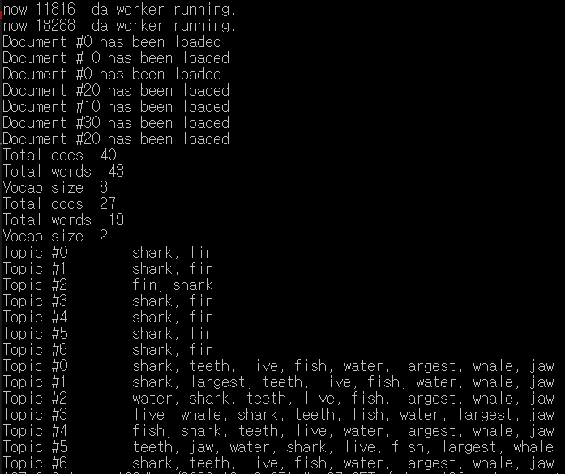

## Audio to Topic
### Audio to Script
Audio Extension : `wav`  
Rate in Hertz of the Audio : 16000  
Channel : mono  

#### Process
1. 오디오 파일은 Google STT(Speach to Text) 사용을 위해 1분 단위로 나뉘어 저장
2. 1분 단위의 audio file은 STT의 input이 되어 1분 단위 Script를 생성
3. 1분 단위 Script들은 Topic modeling을 위해 사용자 지정 분(M) 단위(현재는 10qns)로 묶여 병합

**Final output**: `sliced_0.txt` ... `sliced_N.txt` (M 분으로 묶인 Script 파일 N개)

### Script to Topic
Script 파일 갯수 N 개에 대해 각각의 topic을 찾는다.  
Input Extension : `txt`  
Encoding : `cp949`  

#### Process
1. N을 입력으로 받아 LDA를 수행할 Process 들을 생성
2. 각각의 Process는 담당하는 Script에 대해 LDA 수행
    - 영어 기준 Tokenize 수행
    - Topic 갯수는 각 5개로 수행
    - Target Vocab 갯수는 Input에 따라 자동으로 설정

### Summarization

#### Process
1. Total Script를 입력으로 받아 요약본 생성

한국어버전(kor_sentence_word_extractor.py):

library : krwordrank

```bash
pip install krwordrank
```

input : 6째줄에 파일 경로 설정 

output : 24째줄(핵심 단어) 42째줄(핵심 문장) 파일 경로 설정

공통:

입력 파일 문장의 단위는 줄바꿈이어야 합니다.

### API
GET `/lda-api?fileName={name}`  
Request Parameter : fileName (file name in GCS)
Response Body : fileName

Test set
Bucket-name : capstone-test  
Test-fileName : test_shark.wav  
Running-time : 6min  

API Result  
